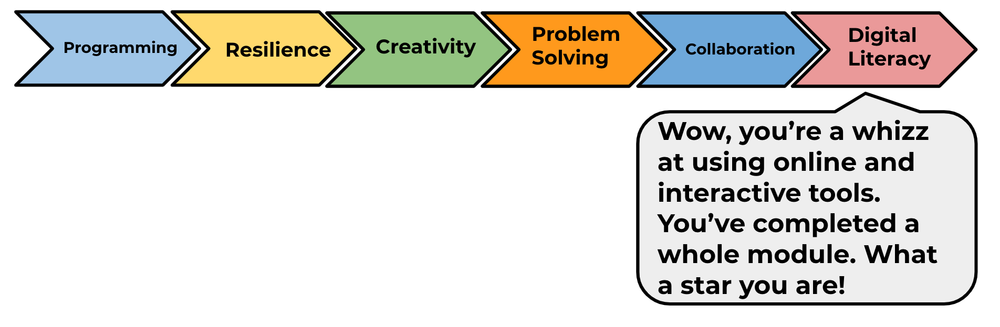

## What have you learned?

Have a go at creating another game by working through the 'CATS!' project.

You can find this project in the module pathway.

--- no-print ---
Click and drag with the mouse to draw a line with the pencil. Your goal is to stop the cats from falling into holes by creating a safe path to the exit.

  <iframe allowtransparency="true" width="485" height="402" src="https://scratch.mit.edu/projects/embed/253667883/?autostart=false" frameborder="0" scrolling="no"></iframe>

--- /no-print ---

--- print-only ---

--- /print-only ---

You can create more games in the Python module such as 'Rock, Paper, Scissors'.

Click on the 'Click me' button to complete the Plenary for this module. Then start another module and learn something completely new:

<a href="https://codeclub.org/en/scratch2">

